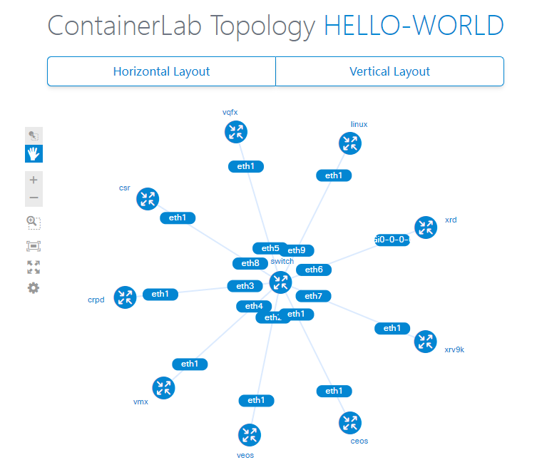

# Hello World

测试 Containerlab 的各种 kind，组建一个简单的 IS-IS 点到多点网络。

## Topology



## Deploy Lab

```bash
cd containerlab-playground/hello-world
sudo containerlab deploy
```

## Verification

```bash
sudo containerlab inspect -a
```

```bash
sudo docker exec -it clab-hello-world-crpd cli
root@crpd> show isis adjacency 
Interface             System         L State         Hold (secs) SNPA
eth1                  ceos           2  Up                    23  aa:c1:ab:5d:36:f8
eth1                  veos           2  Up                    21  c:0:b4:34:78:6b
eth1                  vmx            2  Up                    26  c:0:0:44:5c:1
eth1                  vqfx           2  Up                    21  2:5:86:71:8a:3
eth1                  xrd            2  Up                    27  aa:c1:ab:28:f8:e7
eth1                  xrv9k          2  Up                    28  c:0:fb:c4:1:1
eth1                  csr            2  Up                    23  c:0:a8:a7:8d:1
```

## Destroy Lab

```bash
sudo containerlab destroy -ac
```
